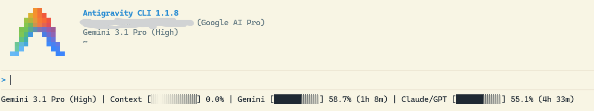

# Antigravity-Pure-HUD

[English](README.md) | [简体中文](README.zh-CN.md)

A lightweight, zero-dependency, ASCII-safe Status Line HUD plugin for **Google Antigravity CLI (`agy`)**.

Unlike other HUD plugins that rely on specialized Nerd Fonts (which often cause glyph rendering issues on Windows Command Prompt / PowerShell), **Antigravity-Pure-HUD** renders high-compatibility progress bars and status telemetry natively across all operating systems.

---

## Preview



---

## Features

- **Zero Dependency & Zero Font Issues**: Renders standard Unicode blocks (`█` & `░`) cleanly across all platforms without requiring Nerd Fonts.
- **Zero-Latency Real-Time Sync**: Combines local daemon HTTP probing with Min-Quota Arbitration to bypass backend cache delays, updating quotas instantly after every prompt.
- **Multi-Pool Quota Tracking**:
  - **Gemini Pool**: Tracks remaining quota percentage and reset countdown for Gemini models.
  - **Claude / GPT (3P) Pool**: Tracks combined remaining quota for 3rd-party models.
- **Responsive Liquid Layout**: Automatically scales progress bar lengths (10 / 8 / 6 / 4 blocks) and truncates labels based on active terminal width to prevent line wrapping.
- **Multi-Platform Support**: Built for Windows (PowerShell / CMD), macOS, and Linux.

---

## Installation

### 1. Clone the Repository
```bash
git clone https://github.com/Darastas/Antigravity-Pure-HUD.git
```

### 2. Register the Plugin with AGY CLI
```bash
agy plugin install ./Antigravity-Pure-HUD
```

### 3. Activate the Status Line in AGY CLI

Inside your interactive `agy` CLI shell, run:

#### Windows (PowerShell / CMD)
```text
/statusline <path-to-repo>/hooks/status-line.bat
```

#### macOS / Linux / Git Bash
```text
/statusline <path-to-repo>/hooks/status-line.sh
```

---

## Configuration & Management

- **Disable Statusline**:
  ```text
  /statusline off
  ```
- **List Installed Plugins**:
  ```bash
  agy plugin list
  ```

---

## License

MIT © [Darastas](https://github.com/Darastas)
